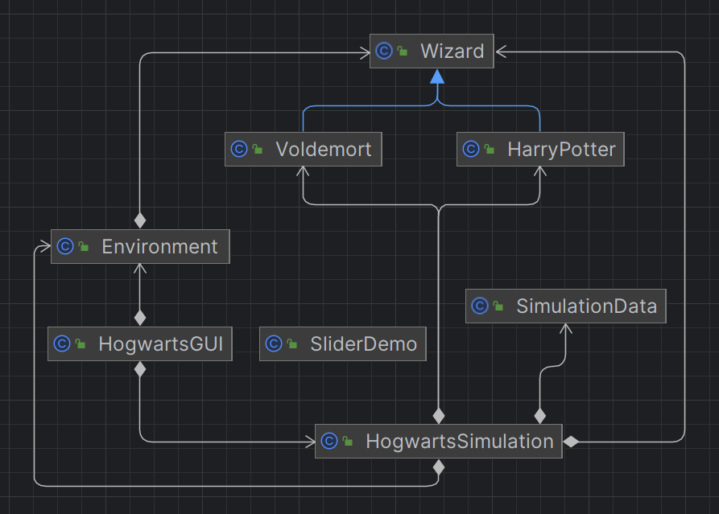

# ABM Simulation Hogwarts

## O projekcie
Projekt Agent-based modelu Predator-Prey w stylu Hogwarts został zbudowany za pomocą Gradle 8.5 i Java 21 w IntellijIDEA.
<be/>Funkcjonalność projektu polega na symulacji różnych scenariuszy i bitew pomiędzy agentami w świecie Hogwartu w zależności od wejściowych parametrów oraz zmian warunków pogodowych.

<br/>Całą funkcjonalność programu możemy zobaczyć dzięki GUI, który utworzyliśmy za pomocą Swing. Też mamy menu w naszym programie w celu interakcji pomiędzy projektem a użytkownikiem.

## Oczekiwane wyniki
Celem programu jest wyznaczenie zwycięcy w symulacji przy odpowiednich parametrach ilości agentów, punktów zdrowia oraz siły uszkodzenia dla każdej drużyny magów.
<br/>Też jako parametr ustawiony zostaje odpowiedni stopień warunków pogodowych oraz wskażniki ilości horkruksów dla Voldemorta i ilości dusz dla Harry'ego Pottera.
<br/>Wszystkie wyniki programu oraz dane o agentach są pokazane po skończeniu działania programu w pliku `info.txt`.

<br/>Przykładowa zawartość pliku `info.txt`
```java
Winner: Aurors

Run Time: 17490 [ms]
Steps: 46
Aurors Count: 55
Death Eaters Count: 45
Aurors Health: 30
Death Eaters Health: 20
Aurors Damage: 15
Death Eaters Damage: 15
Harry's souls: 3
Voldemort horcruxes: 5
Weather level: 2
```

## Struktura projektu
<br/>`Diagrama objektów:`



<br/>Klasy Voldemort i HarryPotter dziedziczą po klasie Wizard. Wskazuje to na typowy hierarchiczny związek, gdzie Voldemort i HarryPotter są specjalizacjami klasy Wizard.
<br/>Obiekty klasy Wizard, Voldemort, i HarryPotter są głównymi jednostkami działającymi wewnątrz symulacji.

<br/>HogwartsGUI wykorzystuje klasę SliderDemo dla utworzenia menu w celu umożliwenia zadania parametrów wejściowych przez użytkownika.
<br/>Klasa SimulationData wykorzystuję swój obiekt w klasie HogwartsSimulation w celu zebrania danych.

<br/>Diagram wskazuje na to, że HogwartsSimulation pełni centralną rolę w projekcie, korzystając z interakcji użytkownika z programem za pośrednictwem HogwartsGUI oraz z klasy Environment dla interakcji głównych jednostek między sobą na mapie.

## Funkcjonalność programu
<br/>Na starcie programu mamy wyświetlony rysunek Hogwartu oraz `menu` z prawej strony ekranu.
<br/>Po ustawieniu przez użytkownika wejściowych parametrów - wciskamy `Setup`, a następnie `Start`.
<br/>Podczas działania programu magowie dwóch drużyn walczą miedzy sobą oraz dwa bohatera: `Harry Potter` i `Voldemort`.

<br/>Logika poruszenia po mapie magów:
```java
MOVE
```
<br/>Logika atakowania:
```java
act
```

<br/>Też ważne jest to że wszyscy agenci mają jakieś dodatkowe warunki zachowania w zależności od warunków pogodowych.
<br/>W przypadku zwykłych magów, oni mają szansę uniknąć szkody. Ale u bohaterów warunki pogodowe dodają dodatkowe siły.

<br/>Końcowym wynikiem programu będzie zwycięstwo jednej z drużyn!
<br/>Logika wyznaczania zwycięcy jest zbudowana w taki sposób, że kiedy magowie jeszcze walczą, ale jeden z bohaterów już zabił drugiego, to pozostałe magowie z drużyny zabitego bohatera przechodzą do drużyny zwycięcy. W innym przypadku, kiedy jedna z drużyn magów już zabiła drugą, a bohatery jeszcze walczą to zwycięstwo wyznaczamy na podstawie magów zwykłych.

<br/>Na końcu program pokazuję powiadomienie z wynikiem programu. Dane zostają przesłane do `info.txt`

## Testy
Jedna z głównych rzeczy w projekcie to testy i naszym zdaniem było ich utworzenie dla najważniejszych metod.
<br/>Ztestowaliśmy każdą klasę i główne ich metody
<br/>Po to zostały utworzonę klasy w 'src/test/hogwarts'.
```java
EnvironmentTest.java
HogwartsGUITest.java
HogwartsSimulationTest.java
SliderDemoTest.java
WizardTest.java
SimulationDataTest.java
```
Żeby zacząć testy, wciskamy start lub wpisujemy './gradlew test' w terminal

## Zrobiono za pomocą
- Gradle 8.5
- Java 21
- JetBrains IntellijIDEA

## Start symulacji
Najpierw musimy otwórzyć terminal.
<br/>My budujemy nasz projekt wpisująć `./gradlew build`.
<br/>Żeby zacząć działanie symulacji, mamy runSim task w `build.gradle`. Więc, po prostu wpisujemy `./gradlew runSim` w terminalu.
<br/>Możemy przetestować program za pomocą `./gradlew test`.

### Made by Oleksandr Radionenko & Anna Osokina
